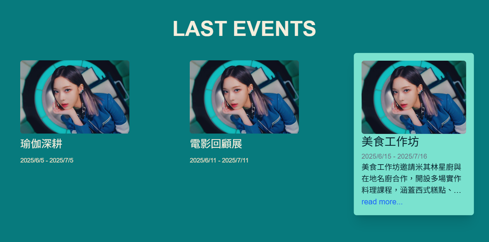
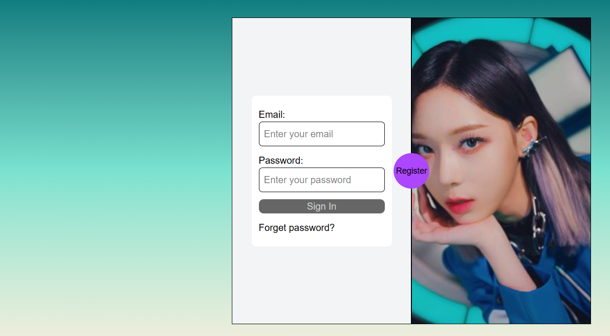
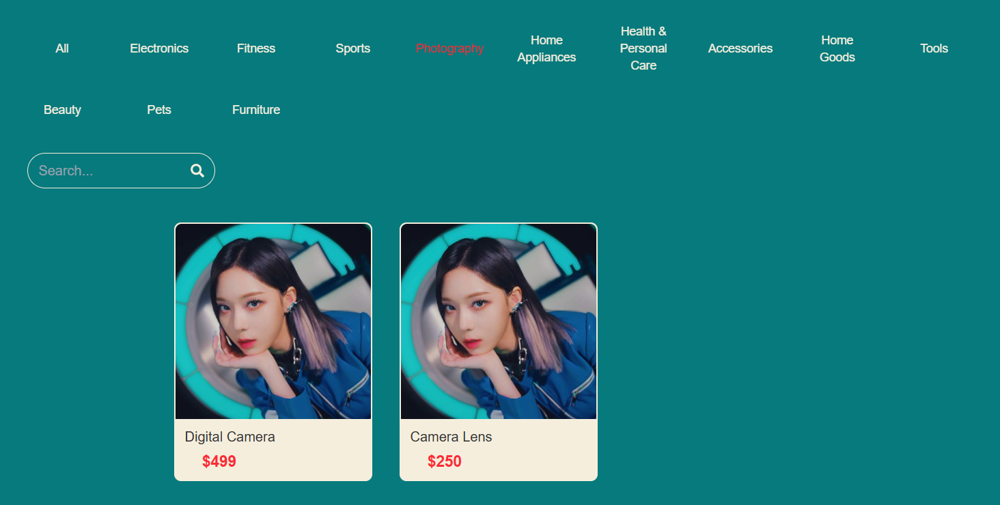
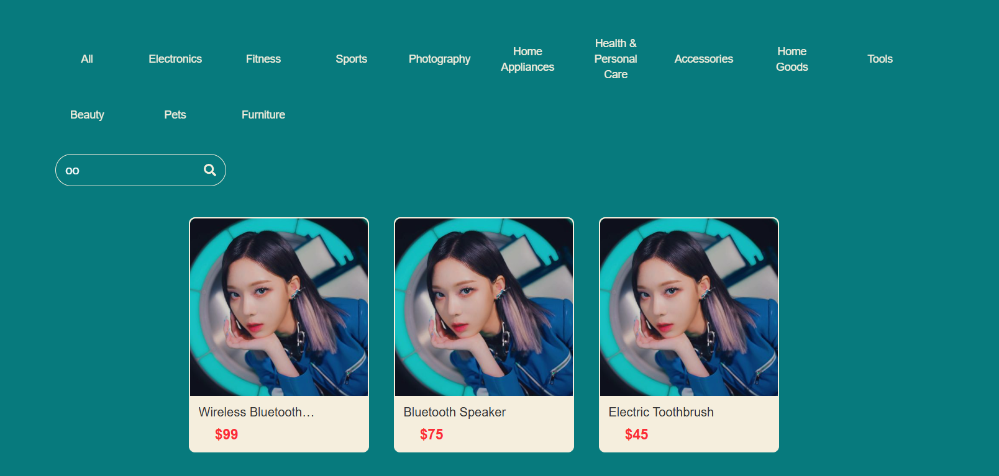
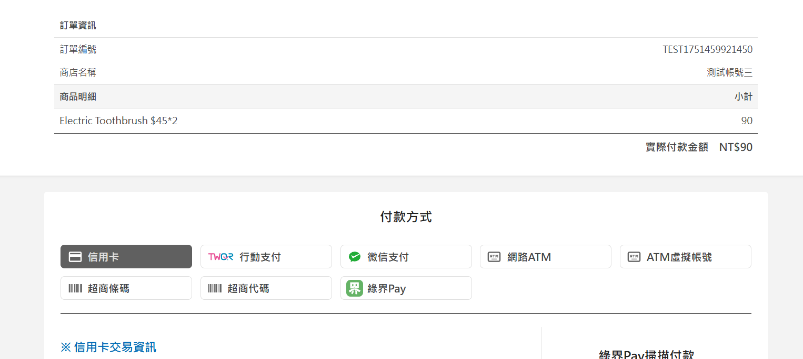

# First Project   
一個簡單的全端電商網站，喜歡winter所以擺很多(有設定確定有圖片的話會被換掉༼ つ ◕_◕ ༽つ)  
以 Vite + React + Tailwind Css + Express.js + MySQL 為技術主軸  
有身分認證、串接第三方金流與後台訂單管理  
  
# 從後端拿來渲染的資料，給一點簡單的的互動  
 
  
# 按中間的按鈕winter會換邊顯示  
  
  
  
# 後端抽取資料後做filter  
  

# 商品放入購物車後選擇此次要買什麼，然後用綠界金流做串接來繳費
  

